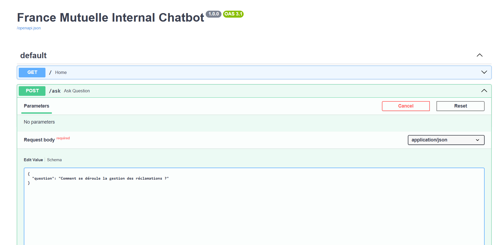
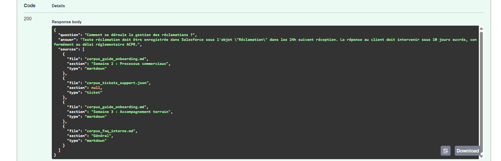
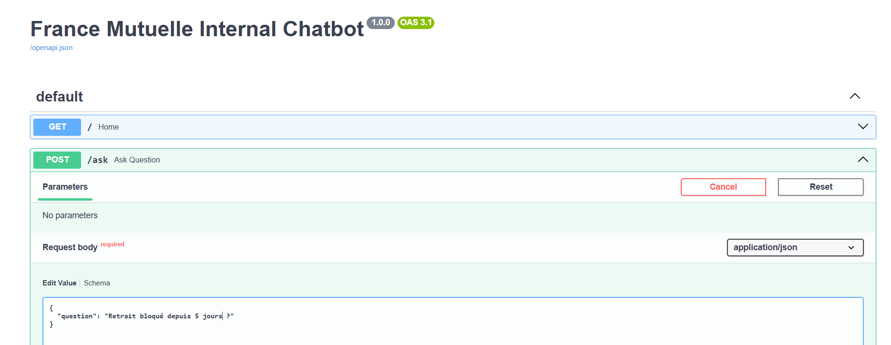
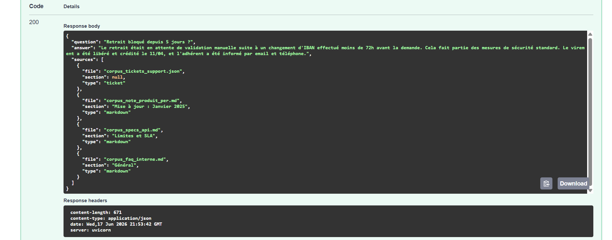
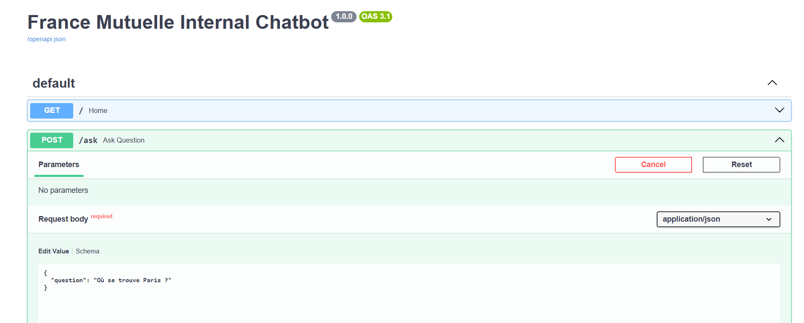
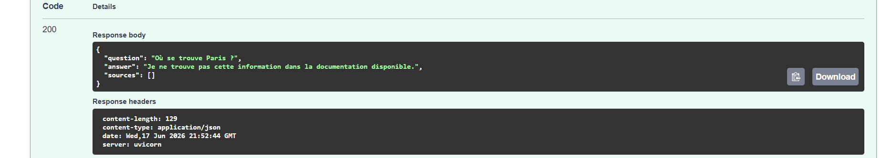

# France Mutuelle - Chatbot RAG Interne

## Contexte

Ce projet a été réalisé dans le cadre d'un test technique pour un poste de ML Engineer.

L'objectif est de développer un chatbot interne destiné aux collaborateurs (commerciaux, gestionnaires, support) permettant d'interroger différents types de documents métier :

* Documentation produit
* Documentation métier
* Documentation technique
* Tickets support

Le système s'appuie sur une architecture RAG (Retrieval-Augmented Generation) afin de fournir des réponses basées uniquement sur les documents du corpus.

---

# Architecture

```text
Documents (.md + .json)
            |
            v
     Document Loader
            |
            v
 OpenAI Embeddings
(text-embedding-3-small)
            |
            v
        ChromaDB
            |
            v
        Retriever
            |
            v
        GPT-4o-mini
            |
            v
     FastAPI / Streamlit
```

---

# Structure du projet

```text
src/
│
├── app/
│   ├── app.py
│   ├── routes.py
│   ├── schemas.py
│   └── streamlit_app.py
│
├── components/
│   ├── document_loader.py
│   ├── embeddings.py
│   ├── vector_store.py
│   ├── retriever.py
│   ├── llm.py
│   └── prompt.py
│
├── pipelines/
│   ├── ingestion_pipeline.py
│   └── rag_pipeline.py
│
└── utils/
    ├── logger.py
    └── exception.py
```

---

# Choix techniques

## LLM

Le modèle utilisé est :

```text
gpt-4o-mini
```

Ce modèle offre un bon compromis entre qualité de génération, rapidité d'exécution et coût.

## Embeddings

Le modèle utilisé est :

```text
text-embedding-3-small
```

Ce modèle fournit des embeddings performants pour la recherche sémantique tout en restant économique.

## Base vectorielle

Le stockage vectoriel repose sur :

```text
ChromaDB
```

Les embeddings sont enregistrés localement afin d'éviter de reconstruire la base à chaque exécution.

---

# Stratégie de chunking

## Documents Markdown

Les documents Markdown sont découpés à l'aide de :

```python
MarkdownHeaderTextSplitter
```

Cette approche permet de conserver la structure métier des documents (titres H1, H2 et H3) et de produire des chunks cohérents sémantiquement.

Aucun découpage récursif supplémentaire n'a été appliqué car les sections obtenues étaient déjà de taille raisonnable.

## Tickets Support

Chaque ticket est conservé comme une unité sémantique complète :

```text
1 ticket = 1 document
```

Cette stratégie facilite la récupération d'informations spécifiques à un ticket donné.

---

# Fonctionnalités

## Recherche documentaire

Le chatbot peut répondre à des questions portant sur :

* Les produits d'épargne
* Les procédures métier
* La documentation API
* Les tickets support

## Citation des sources

Chaque réponse affiche les documents utilisés pour générer la réponse :

```text
corpus_specs_api.md > Authentification
```

## Gestion du hors corpus

Si l'information n'est pas présente dans les documents fournis, le système répond :

```text
Je ne trouve pas cette information dans la documentation disponible.
```

Dans ce cas, aucune source n'est affichée.

## Logging

L'ensemble du pipeline est journalisé afin de faciliter le débogage et le suivi des traitements.

---

# Installation

## Création de l'environnement

```bash
conda create -p venvtest python==3.13 -y
```

Activation :

```bash
conda activate venvtest
```

## Installation des dépendances

```bash
pip install -r requirements.txt
```

## Variables d'environnement

Créer un fichier `.env` :

```env
OPENAI_API_KEY="..."
```

---

# Construction de la base vectorielle

Lancer l'ingestion :

```bash
python -m src.pipelines.ingestion_pipeline
```

Cette étape :

* charge les documents
* génère les embeddings
* construit la base ChromaDB

---

# Lancement de l'API FastAPI

```bash
uvicorn src.app.app:app --reload
```

Documentation Swagger :

```text
http://localhost:8000/docs
```











---

# Lancement de l'interface Streamlit

```bash
streamlit run src/app/streamlit_app.py
```

[interface Streamlit1](images/streamlit1.png)
[interface Streamlit2](images/streamlit2.png)


---

# Évaluation

L'évaluation a été réalisée à partir de plusieurs questions représentatives du corpus.

## Documentation métier

Question :

```text
Comment se déroule la gestion des réclamations ?
```

Résultat :

* Réponse correcte
* Source retrouvée

## Documentation technique

Question :

```text
Comment obtenir un token ?
```

Résultat :

* Réponse correcte
* Source API retrouvée

## Tickets support

Question :

```text
Retrait bloqué depuis 5 jours
```

Résultat :

* Ticket retrouvé
* Réponse cohérente avec la résolution

## Hors corpus

Question :

```text
Où se trouve Paris ?
```

Résultat :

* Refus de répondre
* Aucune source affichée

## Métriques RAG

Les critères suivants ont été utilisés pour évaluer le système :

* Faithfulness : la réponse est supportée par les documents récupérés.
* Context Recall : les documents pertinents sont retrouvés par le retriever.
* Answer Relevancy : la réponse répond à la question posée.

Compte tenu de la taille réduite du corpus et du temps imparti au test, une évaluation qualitative a été privilégiée plutôt qu'une intégration complète de RAGAS.